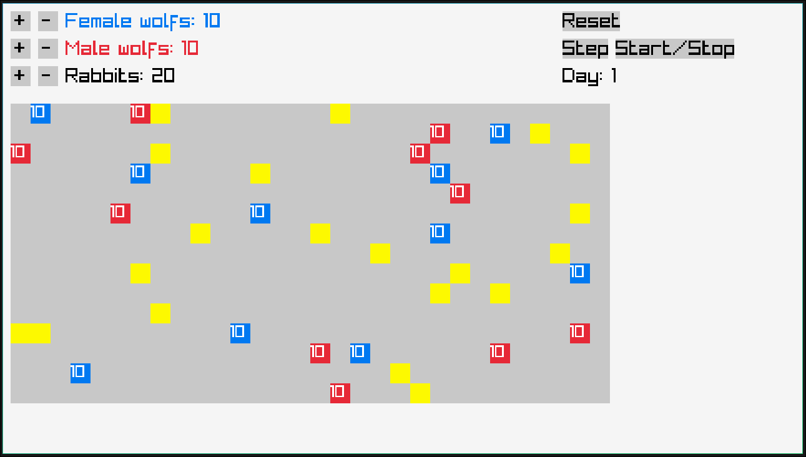
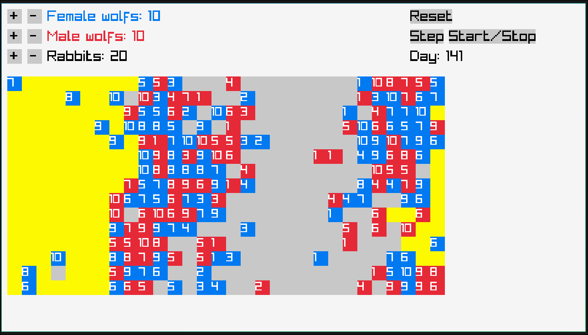
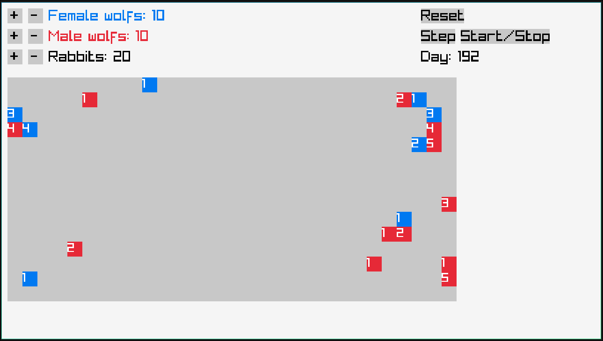

# Raptors-And-Prey
---
Это клеточная симуляция экосистемы "Охотник-добыча" на поле размером **30 × 15**.

## Краткое резюме правил

- **Кролики**: размножаются или двигаются в пустые соседние клетки.
- **Сытые волки**: ищут партнёра противоположного пола для размножения.
- **Голодные волки**: ищут кроликов и едят их.
- **Волки средней сытости**: просто двигаются.
- **Энергия волков** падает со временем.
- При нулевой энергии волк умирает.
- Поле зациклено по краям.

## Скриншоты

## Правила
Каждая клетка может содержать одно из следующих состояний:

- `EMPTY` — пусто;
- `RABBIT` — кролик;
- `FEMALE_WOLF` — самка волка;
- `MALE_WOLF` — самец волка

Переход за границу поля переносит на противоположную сторону (поле зацикленно).

### Волки
У волков есть параметр **энергии** (`value`).

- при создании энергия волка равна **10**;
- энергия уменьшается с каждым ходом;
- если энергия становится `<= 0`, волк умирает.

### Правила для кроликов

Каждый кролик за ход делает следующее:

1. Если рядом нет пустой клетки, он ничего не делает.
2. Если рядом есть пустая клетка, случайно выбирается сценарий:
   - с вероятностью **2/11** кролик **размножается**;
   - с вероятностью **9/11** кролик **перемещается**.

### Правила для волков

Волк действует в зависимости от своего уровня энергии.

#### 1. Сытый волк (`energy > 8`)
Такой волк пытается **размножаться**.
Условия размножения:
В соседних клетках должен быть волк противоположного пола, который:

- находится рядом;
- активен;
- имеет энергию **больше 8**.

Также рядом должна быть хотя бы одна пустая клетка для детёныша.

#### 2. Голодный волк (`energy <= 5`)
Такой волк пытается **охотиться на кролика**.

Если рядом есть кролик:
- волк переходит в клетку кролика;
- кролик исчезает;
- энергия волка становится **10**.

Если рядом кролика нет:
Волк пытается перейти в случайную соседнюю пустую клетку.

#### 3. Обычный волк (`6 <= energy <= 8`)
Такой волк просто перемещается.
